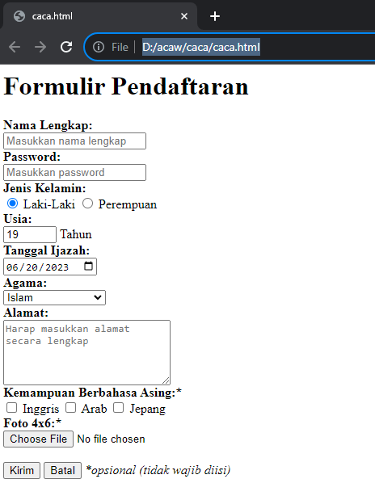

# Struktur dasar html
### contoh
```html
<!DOCTYPE  html>
<html>
  <head>
    <title> cari sendiri </title>
  </head>
  <body> 
    <p><h1>ini siapa</h1></p>
  </body>
</html>
```

### penjelasan
- Tag `<!DOCTYPE html>` memberitahukan web browser bahwa dokumen HTML adalah versi 5.
- Tag pembuka  `<html>` menandai awal sebuah dokumen HTML sampai dengan tag pentup `<html>`
- Tag pembuka `<head>` berisi informasi tentang halaman `HTML` sampai dengan tag penutup `<head>` biasanya tag head terdapat tag untuk memberikan informasi judul halaman `HTML`
- Apapun tag yang berada antara tag pembuka `<body>` sampai dengan tag penutup `<body>` akan tampil di web browser. 

### hasilnya:


# Anatomi Elemen Html
### contoh
```html
<a href="http ://www.goggle.com"> klik goggle !</a>
```

### penjelasan
- Tag pembuka `<a>` digunakan untuk membuat link yang akan di masukkan pada web browser yang di akhiri dengan tag penutup `<a>`
- Atribut `href` untuk menentukan alamat link yang di tuju
- `http ://www.goggle.com` merupakan nilai atribut dari `href`
- untuk membuka link yang di buat, gunakan `klik goggle` sebagai refensi untuk membuka konten atau isi tag yang ada pada atribut.

### hasilnya:

Tampilan di atas merupakan sebuh hasil.

# Tag Dasar

## Heading 
Heading digunakan untuk menunujukkan bagian penting pada halaman browser dan memiliki enam tingkatan yang berurutan yaitu `h1 hingga h6`.
### contoh 
```html
<!DOCTYPE html>
<html>
  <head>
    <title>Tag Dasar</title>
  </head>

  <body>
 <h1>sangat besar</h1> </h1>
 <h2>Lumayan besar </h2>
 <h3>Besar</h3>
 <h4>Kecil </h4>
 <h5>Lumyan kecil </h5>
 <h6>Sangat Kecil</h6>
  </body>
</html>
```

### penjelasan 
- Tag `<h1>` Digunakan untuk judul utama atau menjadikan teks sangat besar 
- Tag `<h2>` Menunjukkan Teks menjadi lumayan besar 
- Tag `<h3>` Menunjukkan teks menjadi besar 
- Tag `<h4>` Menunjukkan tingkatan judul yang lebih rendah atau menjadi kecil 
- Tag `<h5>` Menunjukkan tingkatan judul yang lebih rendah atau menjadi lumayan kecil 
- Tag `<h6>` Menunjukkan tingkatan judul yang lebih rendah atau menjadi sangat kecil

### hasilnya


## paragraf
### Contoh  
```html
<!DOCTYPE html>
<html>
  <head>
    <title>ini adalah judul</title>
  </head>
  <body>
    <p>Ini adalah tag paragraf</p>
    <p><b>Ini adalah tag bold</b></p>
    <p><u>Ini adalah tag garis bawah</u></p>
    <p><i>ini adalah teks miring</i></p>
    <P>ini adalah tag untuk <br> membuat baris baru </br>
  </body>
  <html/>
  ```

### penjelasan
- Tag `<p>`berguna agar kumpulan kalimat yang akan ditandai tidak bercampur dengan paragraf yang lain, diakhiri dengan `<p>` sebagai penutup
- Tag `<b>` berguna untuk membantu teks menjadi tebal/bold lalu diakhiri dengan tag penutup`<b>`
- Tag `<u>` digunakan untuk menggarisbawahi teks agar menunjukkan bagian tertentu dari teks di akhiri dengan tag penutup `<u>`
- Tag `<i>` digunakan untuk membuat teks miring agar menekankan makna semantik dan diakhiri dengan tag `<i>`sebagai penutup
- Tag `<br>`digunakan untuk membantu baris baru atau sering disebut dengan enter lalu diakhiri dengan `<br>`sebagai penutup

### Hasilnya 


## Atribut align
### Contoh  
```html
<!DOCTYPE html>
<html>
  <head>
    <title>ini adalah judul</title>
  </head>
  <body>
   <h3>Belajar Menggunakan Elemen Tag Html</h3>
   <p align="left">
   Jika kamu hanya bertahan di zona nyaman, maka kamu tak akan pernah tahu banyak hal. Jangan takut mencoba!
   </p>
   <p align="right">
   Jangan kutuk dirimu atas kesalahan yang kamu buat di masa lalu, jadikan sebagai pelajaran dan berusaha hidup lebih baik.
   </p>
   <p align="center">
   Seburuk apapun masa lalumu, itu telah berlalu. Sekarang, fokus untuk kebahagiaan dirimu di masa depan.
   </p>
   <p align="justify">
   Ada dua tipe orang di dunia ini. Mereka yang mempunyai mimpi besar, dan mereka yang bangun untuk mewujudkannya.
   </p>
  </body>
</html>
```

### penjelasan
`*Atribut align*` adalah atribut yang menentukan perataan teks.
ada beberapa macam nilai atribut align sebagai berikut.
- `c  enter `: membuat seluruh teks ke tengah halaman web, penulisannya `align=”center”`
- `left `: membuat seluruh teks ke sisi kiri halaman web, penulisannya `align=”left”`
- `right `: membuat seluruh teks ke sisi kanan halaman web, penulisannya `align=”right”`
- `justify `: meregangkan baris sehingga setiap baris memiliki lebar yang sama (seperti dikoran dan majalah) penulisannya `align=”justify”`

### Hasilnya


## komentar
### contoh 
```html
<!DOCTYPE html>
<html>
  <head>
    <title>ini adalah judul</title>
  </head>
  <body>
   <!--Ini komentar, tidak akan tampil di browser -->
   <p>ini bukan komentar,dan  akan tampil di browser </p>
   </p>
 
  </body>
</html>
```

### penjelasan
Jika ingin menambahkan komentar yang hanya satu baris, kamu bisa menggunakan sintaks 
`<!-- Ini adalah komentar -–>`
Apa yang ditulis di antara `< !-- dan – >` adalah komentar dan tidak akan ditampilkan di browser.

### Hasilnya 


## List
`List` adalah fungsi dalam `HTML` yang digunakan untuk menampilkan daftar dari sesuatu. Dalam HTML, tag list terdiri dari 2 jenis, `<ol>` *ordered list (berurutan)* dan `<ul>` `**unordered list (tidak berurutan)**`. Ordered list akan ditampilkan dengan atau huruf, sedangkan unodered list dengan bulatan atau kotak ataupun simbol lainnya. 
> [!note] - untuk menampilkan list dalam HTML dapat menggunakan tag `<li>` ...` </li>` namun perlu dengan menyisipkan elemen `<ol> `...` </ol>` atau `</ul>` ke dalam elemen `<li>` tersebut untuk membuat daftar

### contoh
```html
<!DOCTYPE html>
<html>
  <head>
    <title>ini adalah judul</title>
  </head>
  <body>
<h1>Cara membuat kopi</h1>
        <p>Bahan-bahan</p>
        <ul>
            <li>2sdt kopi bubuk</li>
            <li>2sdt gula pasir</li>
            <li>air panas secukupnya</li>
        </ul>
        <p>langkah-langkah</p>
        <ol>
            <li>masukkan bubuk kopi dan gula ke dalam cangkir</li>
            <li>seduh dengan air panas mandidih</li>
            <li>aduk dan siap dihidangkan</li>
        </ol>
  </body>
</html>
```

### penjelasan
- `Ordered list` atau list angka/nomor dibuat dengan menggunakan tag `<ol>`. Penulisan item-item list tersebut menggunakan tag`<li>`yang ditelakkan diantara tag pembuka `<ol> ` dan tag penutup `</ol>`.
- `Unordered list` atau list simbol dibuat dengan menggunakan tag `<ul>`. Sama dengan list sebelumnya, item-item list ini ditulis dengan menggunakan tag `<li>`yang terletak di dalam elemen ` <ul> ` .

### hasilnya 
 
 
## Link
Link dapat ditemukan di hampir semua halaman web. Link/Tautan memungkinkan sebuah teks yang ketika di-klik akan pindah ke halaman lainnya. HTML menggunakan tag `<a>` untuk keperluan ini. Link ditulis dengan`<a>` yang merupakan singkatan cari anchor
> [!bote] - Setiap tag `<a>` setidaknya memliki sebuah atribut `<href>` , Dimana `<href>` berisi alamat yang dituju. `<href>` adalah singkatan dari hypertext reference.

Atribut penting lainnya dari tag `<a>` adalah `<target>`. Atribut target menentukan tempat untuk membuka dokumen yang ditautkan. Atribut `<target>` memiliki beberapa nilai salah satunya `<_blank>` yang berfungsi untuk membuka tautan di tab baru.
### contoh
```html
<!DOCTYPE html>
<html>
  <head>
    <title>ini adalah judul</title>
  </head>
  <body>
    <a href="https://www.google.com" target="_blank"
      >klik disini untuk ke google</a
    >
    <a href="halaman_lain.html"
      >klik disini untuk ke halaman lain yang saya buat!</a
    >
  </body>
</html>
```

### penjelasan
Link ditulis dengan **`<a>`** yang merupakan singkatan cari _anchor_ (jangkar). Setiap tag `<a>` setidaknya memiliki sebuah atribut **href**. Dimana **href** berisi alamat yang dituju (_href_ adalah singkatan dari _**hypertext reference**_).

### Hasilnya
 
## Multimedia
### Gambar 
Dalam HTML gambar didefinisikan dengan tag ``. Tag ` [!note]- Atribut `<scr>` setidaknya mesti ada dalam tag ini untuk menemukan URL (alamat web) dari gambar yagn ingin ditampilkan.

Atribut `<alt>` menyediakan teks alternatif untuk gambar, jika pengguna karena beberapa alasan tidak dapat melihatn ya (karena  koneksi lambat, kesalahan pada atribut `<src>`, atau jika web browser telah disetting untuk tidak menampilkan gambar). Jika browser tidak dapat menemukan gambar, maka akan muncul nilai pada atribut alt.

Dalam tag``terdapat juga atribut `<widht>` dan `<height>` untuk mengatur ukuran gambar, pada versi HTML5 standar satuan ukuran gambar adalah pixel. 

- Misalnya dalam folder root terdapat file gambar bernama logo.png. Untuk menampilkan gambar tersebut kita hanya perlu mengisi nama gambar beserta jenis ekstensi file gambar ke dalam atribut `<src>`, contohnya src = "logo.png".
- Untuk menampilkan gambar dari internet carilah link gambar yang akan ditampilkan lalu masukkan dalam nilai atribut
#### contoh 
```html
<!DOCTYPE html>
<html>
  <head>
    <title>paragraf align</title>
  </head>
  <body>
    
  </body>
</html>
```
#### hasilnya

Berikut letak gambar yang dimuat pada web diatas


### Vidio
HTML `<video>`  element digunakan untuk merujuk sumber file video, sehingga dapat diputar (dimainkan) pada halaman web.
Dalam merujuk sumber file video, digunakan attribute `src` yang menunjukkan _source_ (sumber) yang mengarah pada link file video tersebut berada (disimpan), ditulis baik didalam element `<video>` itu sendiri atau didalam element `<source>` yang merepresentasikan sumber video lebih dari satu format, sehingga browser dapat memilih format video yang tepat (didukung).
`controls` Menginstruksikan browser untuk menampilkan antarmuka (user interface) untuk video control (seperti menampilkan tombol putar (play), kontrol volume dan lain sebagainya).Value: `controls` atau (dikosongkan)
`width` Menentukkan (ukuran) lebar pemutar video (video player). Value: `Pixels`
`src` Menentukkan URL yang mengarah pada sumber video file berada (disimpan). Value: `URL`

#### contoh
```html
<!DOCTYPE html>
<html>
  <head>
    <title>multi video</title>
  </head>
  <body>
    <video controls="true" width="450px">
      <source src="aouad.mp4" type="video/mp4" />
    </video>
  </body>
</html>
```
#### hasilnya

Berikut letak vidio yang dimuat pada web diatas


### Audio
HTML `audio` element menunjukkan sebuah sound atau audio yang dapat disisipkan pada halaman web dan diputar untuk didengarkan.
Modern browser mendukung beberapa format file audio diantaranya: mp3, ogg dan wav.
Konten lain (seperti teks) dapat disisipkan untuk browser yang tidak mendukung HTML5 audio, dan apabila audio file tidak dapat diputar, maka konten ini akan muncul sebagai gantinya (_fallback_).
	Atribut kontrol pada elemen `<audio>` menambahkan fungsi kontrol audio seperti putar, jeda, dan volume.

Kemudian elemen <source> ini memungkinkan HTML untuk menentukan file audio alternatif yang dapat dipilih browser. Browser akan menggunakan format yang dikenali.
Teks yang terletak diantara tag `<audio>` dan `</audio>` hanya akan ditampilkan apabila browser yang digunakan tidak mendukung elemen `<audio>`.
#### contoh
```html
<!DOCTYPE html>
<html>
  <head>
    <title>Multimedia</title>
  </head>
  <body>
    <audio src="liar angin.m4a" controls>
    Browser anda tidak mendukung elemen </audio>
  </body>
</html>
```

Atribut control mengaktifkan perintah seperti mengatur **volume**, **pause**, **play**, **mute**, dan **stop**. Sedangkan atribut **src** menunjukkan di mana lokasi file **audio** di simpan.
Pada contoh sebelumnya kita langsung menuliskan nama file **liar angin.m4a** di dalam atribut **src** yang berarti file **Multimedia.html** yang memanggil **audio** tersebut di simpan bersama-sama di dalam satu folder yang bernama **HTML Audio**.
##### hasilnya

	Berikut letak audio yang dimuat pada web diatas


## Halaman web lainnnya
### contoh
```html
<!DOCTYPE html>
<html>
  <head>
    <title>Halaman web lain</title>
  </head>
  <body> 
    <iframe
      src="https://id.wikipedia.org/wiki/Halaman_Utama"
      width="800"
      height="500"
    ></iframe>
  </body>
</html>
```

### penjelasan
Eelmen `<iframe>` dapat digunakan untuk menampilkan halaman website lain dalam suatu website. atau menampilkan dokumen HTML lain dalam sebuah website.Mudahnya,bisa dibilang website dalam website.
Contoh penggunaaan seperti ini.jika kita mempunyai website sekolah, lalu di website tersebut ingin menampilkan alamat dalam goggle map sekolah, agar memudahkan pengunjung website, kita bisa langsung saja tampilkan halaman sekolah yang ada di goggle maps.

Dalam tag`<ifream>` ada beberapa atribut yang penting seperti : 
- `<src>` untuk mencari sumber halaman html atau web yang akan ditampilkan di dalam frame
- `<width` dan `<height`, untul mengukur ukuran panjang dan lebar fari frame.

### hasilnya


## Table
Tabel dalam HTML didefinisikan dengan tag `<table>`
- Setiap baris tabel didefinisikan dengan tag `<tr>`
- Header (judul) tabel didefinisikan dengan tag `<th>`.secara defaut, header tabel memiliki teks tebal dan berada di tengah.
- Data/tabel didefinisikan dengan tag`<ed>`.karena sel merupakan  bagian terkecil dari tabel maka dari itu tag ini selalu selalu berada dalam tag `<tr>`.

### contoh
```html
<table border="1">
<tr>
  <th>nama</th>
  <th>asal intitusi</th>
  </tr>
  <tr>
  <rd>fatsa akhwani<td/> 
```

### penjelasan
perhatikan bahwa pada tag `<table>` terdapat sebuah atribut `<border>`. Atribut `<border>` digunakan untuk memberikan nilai garis tepi dari table. Nilai ini dalam ukuran pixel.
`<border="1"`, berarti kita menginstrusikan kepada web browser bahwa tabel tersebut akan  memiliki garis tepi sebesar 1 pixel.Jika tidak ditambahkan, secara default tabel tidak memiliki garis tepi.
selain itu terdepat pula beberapa atribut tabel yang penting untuk diketahui yaitu : 
- `rowspan` merupakan atribut HTML yang berfungsi untuk menggabungkan beberapa garis (ke bawah).
- `<colspan>` atau column span merupakan atribut HTML yang berfungsi untuk menggabungkan beberapa kolom (ke samping).
- `<width>` berfungsi untuk mengatur lebar tabel yang nilainya di definisikan dalam satuan pixel secara default.
- `<height>` berfungsi untuk mengatur tinggi tabel yang nilainnya didefinisikan dalam satuan pixel secara default.
- `<align>` berfungsi untuk mengatur perataan teks pada tabel, Nilai atribut yang dapat diberikan yaitu `<left>` untuk perataan teks ke kiri `<right>` untuk perataan teks ke kanan,dan `<center>` untuk pertaan teks ke tengah.

contoh : 
```html
<!DOCTYPE html>
<html>
  <head>
    <title>Membuat Tabel HTML</title>
  </head>
  <body>
    <table border="1" width="40%">
      <tr>
        <th rowspan="2">Nama</th>
        <th colspan="2">Asal Institusi</th>
      </tr>
      <tr>
        <th width="150">sekolah</th>
        <th width="100">Jurusan</th>
      </tr>
      <tr>
        <td>bintang maulana</td>
        <td>Sman 12 makassar</td>
        <td>ipa</td>
      </tr>
      <tr>
        <td>Muhammad wawan</td>
        <td>Smk kehutanan</td>
        <td>kehutanan</td>
      </tr>
      <tr>
        <td>ismail bin mail</td>
        <td>Sekolah menengah analis kimia</td>
        <td>farmasi</td>
      </tr> 
      <tr>
        <td>Putri angreini</td>
        <td>Sman 13 makassar</td>
        <td>ips</td>
      </tr>
    </table>
  </body>
</html>```

### hasilnya
 
## Form
Elemen `<form>` HTML digunakan untuk mendefinisikan form yang digunakan untuk mengumpulkan inputan dari pengguna website. Tag ini digunakan untuk mengkoleksi inputan dari user, konsep ini sama seperti konsep formulir di dunia nyata.

>[!note] - Dengan kata lain tag `<form>` merepresentasikan sebuah "formulir" di mana satu formulir bisa memiliki banyak kolom isian.

Form HTML berisikan elemen-elemen `<form>`  lainnya. Elemen `<form>` digunakan untuk menampung macam-macam elemen yang berkaitan dengan sebuah `form`, seperti `text` `fields`, `checkbox`, `radio button`, `tombol subalt`, dan banyak lagi yang dapat diedit kemudian ditulis untuk dikirim pada sebuah server untuk selanjutnya diproses guna mendapatkan informasi tertentu dari atau untuk user.

Umumnya, sebuah website selalu memiliki fitur form, contoh paling umum yang sering kita temui adalah seperti form login, form sign up, form komentar di suatu blog/media. 1. Input

### Input
Elemen `<input>` adalah elemen `form` yang paling penting. Elemen `<input>` dapat ditampilkan dalam beberapa cara, tergantung pada nilai atribut `type` yang digunakan. Request Berikut adalah beberapa contoh nilai dari atribut `type`:
- `text` digunakan untuk mengambil isian berupa teks. Contohnya seperti nama.
- `password` digunakan untuk mengambil isian berupa kata sandi atau sesuatu yang bersifat rahasia. Tipe ini akan mengubah semua karakter yang diketikkan ke dalam karakter bulat.
- `Radio` digunakan sebagai kolom isian bertipe pilihan yang menawarkan beberapa opsi kepada user namun tetapi hanya satu opsi saja yang boleh dipilih. Contohnya seperti jenis kelamin atau agama.

> [!note] - Perlu diperhatikan bahwa untuk penggunaan tipe radio yang berkategori set pilihan yang sama mengharuskan nilai-nya juga sama.

Opsi default dapat dilakukan dengan menambahkan atribut checked pada elemen opsi yang dijadikan sebagai opsi default.

- `checkbox` digunakan untuk memberikan **daftar pilihan dalam satu set opsi**. User dapat memilih satu atau bahkan lebih dari satu pilihan pada tipe ini. Hal ini berbeda dengan tipe sebelumnya yaitu `radio` yang hanya memungkinkan user untuk memilih satu  pilihan saja. Contoh penggunaan `checkbox` seperti daftar makanan kesukaan, daftar olahraga yang tidak disukai, dan yang semisalnya.

> [!note] - Perlu diperhatikan bahwa untuk penggunaan tipe checkbox yang berkategori set pilihan yang sama mengharuskan nilai name -nya juga sama.

- `Number` digunakan untuk membatasi isian user hanya pada karakter numerik saja. Browser akan menambahkan dua buah tombol atas dan bawah untuk mengubah angka isian.
Beberapa atribut untuk tipe `number`:
    - `min`-menentukan angka minimal
    - `max`-menentukan angka maksimal
    - `step`-smenentukan kelipatan (nilai yang tidak sesuai kelipatan tidak bisa di-input, dan default dari atribut ini adalah 1)
- `Date` digunakan untuk memberikan isian berupa tanggal. Atribut `min` dan `max` dapat pula difungsikan pada tipe ini untuk mengatur tanggal minimal dan tanggal maksimal yang diinginkan. Nilai `min` dan `max` tersebut ditulis dengan format: `YYYY-em-dd`.
- `File` digunakan untuk memungkinkan pengguna memuat file. Atribut `accept` juga dapat disisipkan pada tipe ini dengan maksud untuk mengatur file apa saja yang boleh di-upload. Beberapa contoh value dari atribut `accept` yaitu:

    -`accept-"image/png,inage/jpg.Image/jpeg` - untuk file gambar seperti `png`. `jpg`. atau `jpeg`
    -`accept="pdf"` - untuk file pdf
    -`accept="pdf"` - untuk file pdf
    -`accept-".doc, docx"` - untuk file `doc` atau `docx`
    -`accept-".ppt, pptx"` untuk file `ppt` atau `pptx`

- `submit` ditampilkan dalam bentuk tombol untuk mengirim data pada `<form>` yang menjadi pembungkusnya. Atribut `value` digunakan untuk mengisi teks yang ingin ditampilkan pada tombol.
- `reset` berguna untuk mengembalikan state (keadaan) atau data dari suatu form ke nilai awalnya. Jika nilai awal sebuah input adalah kosong, maka ketika direset ia akan kembali kosong. Tapi jika nilai awalnya sudah terisi sesuatu, maka ketika direset datanya akan kembali seperti yang sudah diset sebelumnya.
- `button` berguna untuk membuat inputan berupa sebuah tombol. Tombol ini nantinya bisa difungsikan sesuai dengan keinginan dari pengembang web.
7
### *Label*
Elemen `<label>` memiliki fungsi khusus untuk melabeli sebuah kolom inputan. Ketika screen reader membaca konten halaman HTML, lalu menemukan sebuah inputan, ia akan membaca label yang bersangkutan. 
Fungsi lain dari tag `<label>` adalah ketika kita mengklik label, maka browser akan meletakkan fokus pada kolom isian yang terhubung dengannya. Syarat yang perlu diperhatikan yaitu dengan menghubungkan sebuah `<label>` dan `<input>` dengan atribut for untuk label, dan atribut id pada `<input>` dengan nilai untuk kedua atribut tersebut mesti sama persis.

### *Select*
Elemen `<select>` berguna dalam mendefinisikan sebuah tombol dropdown yang dimana user dapat memilih salah satu dari banyak pilihan.

>[!note] - Elemen `<select>` nantinya berperan sebagai kontainer atau pembungkus dari elemen `<option>` yang berperan sebagai daftar pilihan atau opsi. 

 Elemen `<select>` hampir mirip fungsinya dengan `<input type ="radio">` akan tetapi baiknya elemen `<select>` digunakan untuk memilih satu pilihan yang terdapat banyak opsi di dalamnya, sedangkan `<input type ="radio">` lebih baiknya untuk digunakan jika user diarahkan memilih hanya satu pilihan yang opsi pilihannya tidak terlalu banyak. Contoh penggunaan elemen ini seperti memasukkan pilihan berupa asal daerah atau yang semisalnya.
Penting untuk diketahui bahwasanya opsi yang aktif secara default adalah adalah opsi yang pertama. Akan tetapi, kita bisa mengatur opsi mana yang aktif secara default dengan menambahkan atribut selected pada suatu `<option>` yang ingin dijadikan sebagai opsi default.

### *Text Area*
Elemen `<textarea>` berguna untuk mengambil inputan user berupa teks yang dapat memuat lebih dari satu baris. Jika dibandingkan dengan elemen `<input>` teks biasa, elemen `<textarea>` memiliki ukuran tinggi yang lebih besar. Element `<textarea>` bisa diisi lebih dari satu baris dengan menekan enter.
Atribut yang dapat digunakan untuk mengatur kuran dari textarea yaitu rows untuk jumlah baris, sedangkan atribut cols untuk lebarnya.

### *Button*
Elemen `<button>` yang berada di dalam sebuah `form` akan otomatis dianggap sama fungsinya seperti `<input type="submit">`. Jika ingin membuat tombol biasa yang tidak men-submit `<form>` dapat dilakukan dengan menambahkan atribut `type="button"`.
contoh : 
```html
<h1>Formulir Pendaftaran</h1>
<form action="">
  <div>
    <label for="nama-lengkap"><b>Nama Lengkap:</b></label
    ><br />
    <input
      type="text"
      id="nama-lengkap"
      name="nama_lengkap"
      placeholder="Masukkan nama lengkap"
      required
    />
  </div>
  
  <div>
    <label for="password"><b>Password:</b></label
    ><br />
    <input
      type="password"
      id="password"
      name="password"
      placeholder="Masukkan password"
      required
    />
  </div>
  
  <div>
    <b>Jenis Kelamin:</b><br />
    <input id="lk" type="radio" name="jenis_kelamin" checked />
    <label for="lk">Laki-Laki</label>
    <input id="pr" type="radio" name="jenis_kelamin" />
    <label for="pr">Perempuan</label>
  </div>
  
  <div>
    <label for="isian-usia"><b>Usia:</b></label
    ><br />
    <input
      type="number"
      id="isian-usia"
      name="usia"
      min="17"
      max="25"
      value="19"
      required
    />
    Tahun
  </div>

  <div>
    <label for="tgl-ijazah"><b>Tanggal Ijazah:</b></label> <br />
    <input
      type="date"
      id="tgl-ijazah"
      name="tgl_ijazah"
      min="2021-01-01"
      value="2023-06-20"
      required
    />
  </div>

  <div>
    <label for="opsi-agama"><b>Agama:</b></label
    ><br />
    <select id="opsi-agama" name="agama" required>
      <option disabled>---Pilih Agama----</option>
      <option value="islam">Islam</option>
      <option value="kristen">Kristen</option>
      <option value="katolik">Katolik</option>
      <option value="hindu">Hindu</option>
      <option value="buddha">Buddha</option>
      <option value="atheis" disabled>Atheis</option>
    </select>
  </div>

  <div>
    <label for="alamat"><b>Alamat:</b></label> <br />
    <textarea
      id="alamat"
      name="alamat"
      cols="25"
      rows="5"
      placeholder="Harap masukkan alamat secara lengkap"
      required
    ></textarea>
  </div>

  <div>
    <b>Kemampuan Berbahasa Asing:*</b><br />
    <input type="checkbox" id="inggris" name="bahasa_asing" />
    <label for="inggris">Inggris</label>
    <input type="checkbox" id="arab" name="bahasa_asing" />
    <label for="arab">Arab</label>
    <input type="checkbox" id="jepang" name="bahasa_asing" />
    <label for="jepang">Jepang</label>
  </div>

  <div>
    <label for="isian-foto"><b>Foto 4x6:*</b></label
    ><br />
    <input
      type="file"
      id="isian-foto"
      name="foto"
      accept="image/png,image/jpg,image/jpeg"
    />
  </div>

  <br />
  <input type="submit" value="Kirim" />
  <input type="reset" value="Batal" />
  <i>*opsional (tidak wajib diisi)</i>
</form>
```

hasil:


Beberapa atribut yang digunakan pada contoh di atas yang perlu untuk diperjelas yaitu sebagai berikut:
- name - digunakan sebagai nama variabel yang akan diproses oleh web server (contoh menggunakan PHP).
- required - digunakan untuk memastikan bahwa pengguna harus memasukkan nilai pada input tersebut sebelum dapat melakukan proses submit formulir.
- placeholder - menuliskan teks pada elemen input. Placeholder sangat bermanfaat untuk memberikan teks bantuan kepada user untuk inputan form yang kompleks.
- value - menentukan nilai awal dari sebuah elemen input.
- disabled - digunakan untuk menonaktifkan inputan pada elemen yang diberi atribut ini.

### *Bagaimana Cara Memproses Form?*
Ketika sebuah `<form>` disubmit, baik menggunakan elemen `<button>` mau pun `<input type="submit">`, browser akan mengirimkan data tersebut kepada URL yang didefinisikan pada atribut action di dalam tag form.
Ada pun jika atribut action tidak didefinisikan, maka browser akan menggunakan URL sekarang sebagai tujuan pengiriman data.
contoh :
```html
<form action**=**"/proses-pendaftaran"**> </form>
```

Pada contoh di atas, ketika form di-submit, browser akan mengirimkan data yang ada  menuju URL /proses-pendaftaran.

**Apa yang terjadi pada URL /proses-pendaftaran?**
Pada URL tersebut terdapat sebuah aplikasi/program yang berjalan di server (bukan di browser). Tugas dari program tersebut adalah mengelola data yang dikirim seperti misalnya menyimpan data tersebut ke dalam sebuah database.
Bahasa yang umum digunakan di dalam server adalah python, nodejs, PHP, dan lain sebagainya.
Untuk mendapatkan gambaran lebih jelas, sebenarnya akan dijelaskan pada modul selanjutnya yang berkaitan dengan materi PHP atau juga bisa dengan membaca tutorial berikut:
```
https://jagongoding.com/web/php/web-dinamis/membuat-dan-menangani-form/https://jagongoding.com/web/php/web-dinamis/membuat-dan-menangani-form/
```

# Latihan form dan tabel
## from
### contoh
```html
<form>
  <label for="nama"> nama : </label>
  <input type="text" id="nama" required />
  <br />
  <br />
  <label for="kata_sandi">Kata sandi : </label>
  <input type="kata_sandi" />
  <br />
  <br />
  Jenis kelamin :
  <input type="radio" name="jk" />
  <label>boy</label>
  <input type="radio" name="jk" />
  <label>girls</label>
  <br />
  <br />
  <label>Bahasa pemrograman yang dikusai :</label>
  <br />
  <input type="checkbox" name="coding" />
  <label>coding</label>
  <input type="checkbox" name="web" />
  <label>web</label>
  <input type="checkbox" name="destop" />
  <label>destop</label>
  <br />
  <br />
  <input type="submit" value="kirim" />
  <input type="submit" value="reset" />
</form>
```

### Analisis
`<label for="nama"> nama : </label>`:
- Ini adalah elemen label yang terkait dengan elemen input menggunakan atribut `for`. Dalam hal ini, elemen input yang terkait memiliki `id="nama"`. Label ini memberikan deskripsi atau keterangan untuk input yang terkait, dan dalam hal ini, label tersebut menunjukkan bahwa input yang diharapkan adalah nama.
`<input type="text" id="nama" required />`:
- Ini adalah elemen input yang digunakan untuk mengumpulkan data dari pengguna.
- Atribut `type="text"` menunjukkan bahwa ini adalah input teks, yang cocok untuk mengumpulkan data teks seperti nama.
- Atribut `id="nama"` mengidentifikasi unik elemen ini, dan digunakan oleh label untuk menghubungkannya.
- Atribut `required` menunjukkan bahwa input ini harus diisi sebelum formulir dapat disubmit. Ini membantu memastikan bahwa input tidak kosong.
`<label for="kata_sandi">Kata sandi : </label>`:
- Ini adalah elemen label yang terkait dengan elemen input menggunakan atribut `for`. Dalam hal ini, elemen input yang terkait memiliki `id="kata_sandi"`. Label ini memberikan deskripsi atau keterangan untuk input yang terkait, dan dalam hal ini, label tersebut menunjukkan bahwa input yang diharapkan adalah kata sandi.
`<input type="kata_sandi" />`:
- Ini adalah elemen input yang digunakan untuk mengumpulkan data dari pengguna.
- Atribut `type="kata_sandi"` seharusnya sebenarnya menjadi `type="password"` untuk menunjukkan bahwa ini adalah input kata sandi. Dengan atribut ini, karakter yang dimasukkan oleh pengguna akan diubah menjadi simbol atau bulatan untuk meningkatkan keamanan.
- Input kata sandi tidak selalu memerlukan atribut `id` atau `for`, tetapi jika digunakan, atribut `id` harus cocok dengan nilai yang diberikan di atribut `for` pada label untuk menciptakan keterkaitan.
 `<input type="radio" name="jk" />`:
- Ini adalah elemen input tipe radio button. Radio button digunakan ketika kita ingin pengguna memilih satu opsi dari beberapa opsi yang tersedia.
- Atribut `type="radio"` menunjukkan bahwa ini adalah radio button.
- Atribut `name="jk"` mengelompokkan kedua radio button bersama. Dengan memberikan nama yang sama (`jk` dalam hal ini), hanya satu radio button dalam kelompok ini yang dapat dipilih pada suatu waktu. Ini membuat radio button saling terkait.
`<label>boy</label>`:
 - Ini adalah elemen label yang terkait dengan radio button pertama. Label ini memberikan deskripsi atau keterangan untuk opsi yang terkait.
`<input type="radio" name="jk" />`:
- Ini adalah radio button kedua dalam kelompok yang sama dengan yang pertama.
- Atribut `name="jk"` menghubungkannya dengan radio button pertama sehingga hanya satu dari keduanya yang dapat dipilih pada suatu waktu.
`<label>girls</label>`:    
- Ini adalah elemen label yang terkait dengan radio button kedua. Label ini memberikan deskripsi atau keterangan untuk opsi yang terkait.
 `<label>Bahasa pemrograman yang dikusai :</label>`:
- Ini adalah elemen label yang memberikan deskripsi atau keterangan untuk opsi yang terkait, yaitu checkbox yang mengikuti.
`<input type="checkbox" name="coding" />`:
- Ini adalah elemen checkbox pertama. Checkbox digunakan ketika kita ingin pengguna memilih satu atau lebih opsi dari beberapa opsi yang tersedia.
- Atribut `type="checkbox"` menunjukkan bahwa ini adalah checkbox.
- Atribut `name="coding"` memberikan nama untuk kelompok checkbox, sehingga lebih dari satu checkbox dapat dipilih dalam kelompok ini.
 `<label>coding</label>`:
- Ini adalah elemen label yang terkait dengan checkbox pertama. Label ini memberikan deskripsi atau keterangan untuk opsi yang terkait.
 `<input type="checkbox" name="web" />`:
- Ini adalah elemen checkbox kedua dalam kelompok yang sama.
- Atribut `name="web"` menghubungkannya dengan kelompok checkbox sehingga hanya satu dari keduanya yang dapat dipilih pada suatu waktu.
`<label>web</label>`:
- Ini adalah elemen label yang terkait dengan checkbox kedua. Label ini memberikan deskripsi atau keterangan untuk opsi yang terkait.
`<input type="checkbox" name="desktop" />`:
- Ini adalah elemen checkbox ketiga dalam kelompok yang sama.
- Atribut `name="desktop"` menghubungkannya dengan kelompok checkbox sehingga hanya satu dari keduanya yang dapat dipilih pada suatu waktu.
`<label>desktop</label>`:
- Ini adalah elemen label yang terkait dengan checkbox ketiga. Label ini memberikan deskripsi atau keterangan untuk opsi yang terkait
`<input type="submit" value="kirim" />`:
- Ini adalah tombol submit dalam formulir HTML.
- Atribut `type="submit"` menunjukkan bahwa ini adalah tombol submit, yang digunakan untuk mengirimkan data formulir ke server.
- Atribut `value="kirim"` menetapkan teks yang akan ditampilkan pada tombol. Di sini, teksnya adalah "kirim".
`<input type="submit" value="reset" />`:    
- Ini adalah tombol reset dalam formulir HTML.
- Atribut `type="reset"` menunjukkan bahwa ini adalah tombol reset, yang digunakan untuk mengembalikan nilai formulir ke nilai awalnya.
- Atribut `value="reset"` menetapkan teks yang akan ditampilkan pada tombol. Di sini, teksnya adalah "reset"

### Hasilnya


## tabel
### Contoh 
```html
<html>
 <head>
  <title>table</title>
   </head>
    <body>
 <table border="1">
 <tr bgcolor="green">
 <th colspan="2" width="100">Nama Hari</th>
 <th colspan="2" width="100">Nama Bulan</th>
 </tr>
 <tr height="30">
 <td>Senin</td>
 <td>Selasa</td>
 <td>April</td>
<td rowspan="2" align="center">Juni</td>
</tr>
 <tr height="30">
 <td>Rabu</td>
 <td>Kamis</td>
 <td>Mei</td>
</tr>
</table>
</body>
</html>
```

### Analisis  
`<table border="1">`: 
- Ini adalah elemen utama yang menandakan awal dari tabel HTML.
- Atribut `border="1"` menetapkan batas tabel menjadi 1 piksel, sehingga tabel akan memiliki garis tepi.
 `<tr bgcolor="green">`: 
- Ini adalah elemen untuk membuat baris dalam tabel.
- Atribut `bgcolor="green"` menetapkan warna latar belakang baris menjadi hijau.
 `<th colspan="2" width="100">Nama Hari</th>`:    
- Ini adalah elemen header sel dalam tabel (th) yang menunjukkan bahwa elemen ini berisi data header.
- Atribut `colspan="2"` menyatukan dua sel (kolom) menjadi satu di dalam baris ini.
- Atribut `width="100"` menetapkan lebar kolom menjadi 100 piksel.
- Teks "Nama Hari" di dalam elemen th adalah konten dari header sel.
 `<th colspan="2" width="100">Nama Bulan</th>`:
- Ini adalah elemen header sel dalam tabel yang serupa dengan sebelumnya, tetapi untuk kolom Nama Bulan.
`<table border="1">`:
- Ini adalah elemen utama yang menandakan awal dari tabel HTML.
- Atribut `border="1"` menetapkan batas tabel menjadi 1 piksel, sehingga tabel akan memiliki garis tepi.
 `<tr bgcolor="green">`:
- Ini adalah elemen untuk membuat baris dalam tabel.
- Atribut `bgcolor="green"` menetapkan warna latar belakang baris menjadi hijau.
 `<th colspan="2" width="100">Nama Hari</th>`:
- Ini adalah elemen header sel dalam tabel (th) yang menunjukkan bahwa elemen ini berisi data header.
- Atribut `colspan="2"` menyatukan dua sel (kolom) menjadi satu di dalam baris ini.
- Atribut `width="100"` menetapkan lebar kolom menjadi 100 piksel.
- Teks "Nama Hari" di dalam elemen th adalah konten dari header sel.
`<th colspan="2" width="100">Nama Bulan</th>`:
- Ini adalah elemen header sel dalam tabel yang serupa dengan sebelumnya, tetapi untuk kolom Nama Bulan. 

### hasilnya


# div & span
## div
`<div>` adalah tag HTML yang digunakan untuk membuat blok konten. Tag ini digunakan untuk mengelompokkan konten dan memberikan atribut tertentu pada blok tersebut.
### contoh
```html
<!DOCTYPE html>
<html>
<head>
    <title>DIV SPAN</title>
</head>
<body>
    <!-- div digunakan untuk memblok satu area dengan tanda baris
    baru setelahnya-->
    <div> ini dibuat menggunakan div </div>
    <div> ini juga menggunakan div</div>
</body>
</html>
```

## span
`<span>` adalah tag HTML yang digunakan untuk membuat blok konten yang tidak memiliki atribut tertentu.
### Contoh
```html
<!DOCTYPE html>
<html>
<head>
    <title>DIV SPAN</title>
</head>
<body>
    <!-- kebalikan <div>-->
    <span> ini digunakan untuk span</span>
    <span> ini juga menggunakan span </span>
</body>
</html>```

